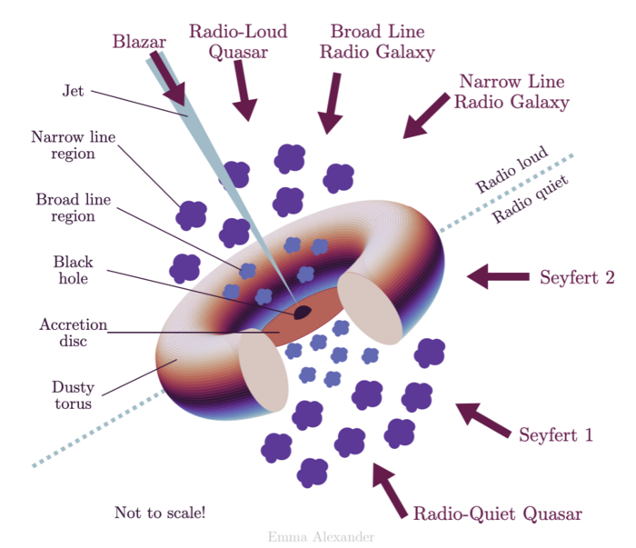

# Studying active galactic nuclei:  extracting a light curve of a variable object and examining an image of a host galaxy

For the Portal Aspect of the Rubin Science Platform at data.lsst.cloud.

**Data Release:** DP0

**Last verified to run:** 2025-03-30

**Learning objective:** Use the ADQL interface to extract multi-band photometry of a variable object

**LSST data products:** `Object` catalog, `deepCoadd` image

**Credit:** Based on tutorials developed by the Rubin Community Science team. Please consider acknowledging them if this tutorial is used for the preparation of journal articles, software releases, or other tutorials.

**Get Support:** Everyone is encouraged to ask questions or raise issues in the [Support Category](https://community.lsst.org/c/support/6) of the Rubin Community Forum.
Rubin staff will respond to all questions posted there.

## Introduction

AGN are luminous point-like sources present in centers of many galaxies, and often are much brighter than the host galaxy.
Those are characterized by a distinct spectrum - usually are bluer than the stars in the host galaxy, and exhibit prominent emission lines.
Their broad-band spectra often extend from the radio regime to X-ray and even gamma-ray bands.
AGN often vary in all observable spectral bands on a wide range of time scales.
This implies a very compact source, typically smaller than a light-year.
The current widely accepted model of an AGN is that the source of power is the accretion of galaxian matter onto the central black hole, releasing its gravitational energy into heat.

Figure 1: A graphic demonstrating various types of active galaxies.
It illustrates that the appearance of a sub-class might depend on the orientation of the axis of symmetry (defined by the accretion disk) with respect to our line of sight.

**Data Preview 0.2 vs. Data Preview 1**

In the Data Preview 0.2 (DP0.2) simulation there are no AGN, but very likely there will be AGN in the real data released as Data Preview 1 (DP1).
However, the DP0.2 contains variable stars and we will pretend one such star is an AGN.
Furthermore, for DP1 the exact types of measurements and their column names are likely to be different, compared to DP0.
The LSST Science Pipelines have evolved considerably since being run on the DP0.2 simulation. 

Here, you will learn how to plot the light curve of a difference image analysis object (diaObject).
In this demonstration, an RR Lyrae star is used. This star has coordinates RA, Dec = 62.1479031, -35.7991348 deg.
This object has an identifier number ``diaObjectId`` = 1651589610221862935.
The ``diaObjectId`` for a given coordinate can be obtained from the ``DiaObject`` table by
making a spatial query on the coordinates with a small radius (a few arcseconds) that returns the ``diaObjectId`` column.
This is illustrated in Step 1.2.  
As is appropriate for steady variable objects (rather than transients such as a supernova), the forced photometry fluxes from PSF model fits in the direct (not difference) images are used.

**This is an introductory-level tutorial, aimed at users who want to get started conducting AGN science.**
Find tutorials on the Portal's User Interface, ADQL interface, and the Results Viewer in the [DP0.2 documentation](dp0-2.lsst.io).

**Related tutorials relevant to AGN science.**
See also the DP0.2 portal tutorials on exploring transient and variable sources, and specifically the one presented last week at the Rubin Assembly covering that subject.  

## 1. Prepare and execute the ADQL query.

### 1.1. Log in to the RSP Portal.

In a browser, go to the URL [data.lsst.cloud](https://data.lsst.cloud).

Select the Portal Aspect and follow the process to log in.

### 1.2. Determine the ``DiaObjectId`` for the object of interest.

Select the DP0.2 Catalogs tab.

Navigate to the DP0.2 UI interface by selecting the "UI assisted" view on the upper right.

Notice that various tables are available in the drop-down menus.

Notice also that query constraints can be set up in this table interface.

From the top menu bar, select the "dp0.2_dc2_catalogs" in the "Table Collection (Schema)" box, and "dp02_dc2_catalogs_DiaObject" in the "Tables" box.

Select ``diaObjectId`` box and the ``nDiaSources`` in the table for the output column selections and constraints on the right.
Under "Enter Constraints" uncheck "temporal" and check "spatial" box.
Enter the coordinates of the object of interest - 62.1479031, -35.7991348 and 3 arc sec as the radius.
Click "Search" - the resulting table on the bottom will show that the ``diaObjectId`` with the largest number of sources (366) is indeed 1651589610221862935.

Figure 2: the Portal UI interface ready to retrieve the ``diaObjectId``.

### 1.3. Navigate to the DP0.2 ADQL interface.

From the top menu bar, select the "DP0.2 Catalogs" tab.

At upper right, click the toggle to "Edit ADQL".

### 1.3. Execute the ADQL query.

Copy and paste the following into the ADQL Query box.

At lower left, click the blue "Search" button.

~~~~mysql    
SELECT cv.expMidptMJD, fsodo.psfFlux, fsodo.psfFluxErr, fsodo.band 
   FROM dp02_dc2_catalogs.ForcedSourceOnDiaObject as fsodo
   JOIN dp02_dc2_catalogs.CcdVisit as cv
   ON cv.ccdVisitId = fsodo.ccdVisitId
   WHERE fsodo.diaObjectId = 1651589610221862935
~~~~

**About the query.**

The query selects 3 columns to be returned from the DP0.2 `Forced Source on DIA Object` table and one column from the `dp02_dc2_catalogs.CcdVisit` table.
Those two tables have a common metadata `ccdVisitId` and the join allows the retrieval of the observatgion epoch.
The use of the `Forced Source` allows to return a measurement of source flux even if it was not detected at the 5 sigma level (the limit for the source flux to be included in the `DIA Source` catalog).
The returned columns are:  

* PSF flux measurement
* PSF flux error
* filters used for the measurements
* and, from the CcdVisit table, the MJD of the observation

The query constrains the results to only include rows that are for an object with `diaObjectId` = 1651589610221862935

Note that the photometric measurements are stored as fluxes in the tables, not magnitudes.
`Object` table fluxes are in nJy, and the conversion is: $m = -2.5\log(f) + 31.4$.

**2. The default plot is an all-filter light curve.**
The first two columns, date and flux, are plotted on the x- and y-axes of the default Active Chart for all filters (Figure 1).

Figure 3: The light curve of the selected variable object, measured in all bands.

**3. Plot a single-filter light curve.**
In the table header, in the "band" column, click on the constraint box and then select "i" in the pop-up window and click "Apply".
The plot will update to display i-band fluxes only (Figure 2).

Figure 4: The light curve of the selected variable object, with only i-band data selected and plotted.

**4. Color markers by band in a multi-band light curve.**
To set marker color based on band (filter),
create a new column in which the band is represented as a number (Figure 5)
and then a color map based on those numbers (Figure 6).
The plot will then display points colored by band (Figure 57.

Figure 5: The "Add a column" pop-up window to create a new column of integer numbers to represent each band.

Figure 6: The "Plot Parameters" pop-up window with the Trace Options set to define a color map based on the new "bands_ascii" column.

Figure 7: The results view with the new "bands_ascii" column and the plotted points colored by the Rainbow color map.

**Notice:**
In the future, the trick of creating an ascii column to represent band as an integer will not be needed.
The development of Portal functionality to plot multi-band light curves in which points are colored by filter is planned.

