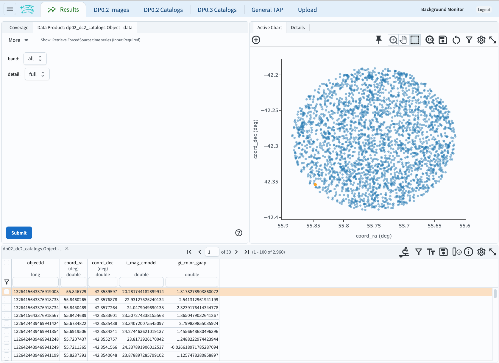

# Comparing the Color-Magnitude Diagram of a set of Field Galaxies with that of a Cluster of Galaxies (Seeing the Red Sequence)

For the Portal Aspect of the Rubin Science Platform at data.lsst.cloud.

**Data Release:** DP0

**Last verified to run:** 2025-04-02

**Learning objective:** Use the ADQL interface to compare the color-magnitude diagram of a set of field galaxies with that of a galaxy cluster. Investigate the r-band `deepCoadd` image of a galaxy cluster.

**LSST data products:** `Object` catalog

**Credit:** Based on tutorials developed by the Rubin Community Science team. Please consider acknowledging them if this tutorial is used for the preparation of journal articles, software releases, or other tutorials.

**Get Support:** Everyone is encouraged to ask questions or raise issues in the [Support Category](https://community.lsst.org/c/support/6) of the Rubin Community Forum. Rubin staff will respond to all questions posted there.

## Introduction

***UPDATE THIS SECTION!***

Strong lensing occurs when a 1) foreground galaxy is aligned with a background galaxy, 2) those two objects are close enough to each other, and 3) the lensing foreground galaxy is sufficiently massive.

The foreground galaxy perceptibly distorts the light from the background galaxy, and the background galaxy appears magnified and multiply-imaged, or as an arc or ring, instead of its true shape.

In this case, the background galaxy is said to be "strongly lensed".

Figure 1: A graphic demonstrating how a distant galaxy (red) appears distorted (pink) due to the mass of a foreground galaxy (blue) from Earth's perspective (right side), and appears as a strongly-lensed object in an image (left side).

**Data Preview 0.2 vs. Data Preview 1**

***UPDATE THIS SECTION!***

In the Data Preview 0.2 (DP0.2) simulation there are no strongly-lensed objects, like there will be in the real data released as Data Preview 1 (DP1).
None of the "potential foreground lens" galaxies explored in this tutorial will have any lensed objects nearby.
Furthermore, for DP1 the exact types of measurements and their column names are likely to be different, compared to DP0.
The LSST Science Pipelines have evolved considerably since being run on the DP0.2 simulation. 

**This is not an introductory-level tutorial!**
Find tutorials on the Portal's User Interface, ADQL interface, and the Results Viewer in the [DP0.2 documentation](dp0-2.lsst.io).

**Related tutorials relevant to galaxy science.**
See also the DP0.2 portal tutorials on exploring extended object populations, and the SAOImage DS9-like functionalities of Firefly.

## 1. Log in to the RSP Portal.

In a browser, go to the URL [data.lsst.cloud](https://data.lsst.cloud).

Select the Portal Aspect and follow the process to log in.

## 2. Navigate to the DP0.2 ADQL interface.

From the top menu bar, select the "DP0.2 Catalogs" tab.

Notice that various tables are available in the drop-down menus.

Notice also that query constraints can be set up in this table interface.

At upper right, click the toggle to "Edit ADQL".

## 3. Study the color-magnitude diagram for a random field.

For comparison with the cluster field, first examine a random field.

The following steps will examine a random field 10 degrees away from of a known cluster in DP0.2.

### 3.1 Execute the ADQL query.

Copy and paste the following into the ADQL Query box.

~~~~mysql    
SELECT obj.objectId, obj.coord_ra, obj.coord_dec, 
	   -2.5*log10(obj.i_cModelFlux)+31.4 as i_mag_cmodel,
	   -2.5*log10(obj.g_gaapOptimalFlux/i_gaapOptimalFlux) as gi_color_gaap
FROM dp02_dc2_catalogs.Object AS obj 
WHERE (obj.detect_isPrimary = 1) AND (obj.refExtendedness = 1) AND 
	  (obj.i_cModelFlux/obj.i_cModelFluxErr > 20) AND 
	  (obj.g_cModelFlux > 0) AND (obj.i_cModelFlux > 0) AND 
	  CONTAINS(POINT('ICRS', obj.coord_ra, obj.coord_dec), 
	          CIRCLE('ICRS',55.75,-42.29, 0.1)) = 1
~~~~

At lower left, click the blue "Search" button.

**About the query.**

The query returns 5 columns from the DP0.2 `Object` table.  Some of these columns come directly from the `Object` table, and some are derived from the ]one or more columns from the `Object` table. 

* an object identifier (integer)
* the coordinates right ascension and declination
* the $i$-band AB magnitude, derived from the $i$-band `cModel` flux
* the $(g-i)$ AB color, derived from the $g$- and $i$-band `gaapOptimal` fluxes 

The query constrains the results to only include rows (objects) that are:

* in the search area (within a 0.1 degree radius of RA, Dec = 56.75 deg, -31.29 deg)
* not a duplicate or parent object (`detect_isPrimary` = 1)
* an extended object, not a point-like source (`refExtendedness` = 1)
* high signal-to-noise in the $i$ band (`i_gaapOptimalFlux`$/$`i_gaapOptimalFluxErr` $>$ 20)
* non-zero flux in the $g$ and $i$ bands (gaapOptimalFlux $>$ 0)

Details about the object flux measurements:

* Photometric measurements are stored as fluxes in the tables, not magnitudes.
* `Object` table fluxes are in nJy and are converted to AB magnitude via the equation $m = -2.5\log(f) + 31.4$.
* The SDSS [Composite Model Magnitudes](https://www.sdss3.org/dr8/algorithms/magnitudes.php#cmodel)
or `cModel` fluxes, which are a measure of total flux for extended objects, are used for the $i$-band magnitudes.
* The optimal-aperture Gaussian-aperture-and-PSF ([Kuijken et al. 2008](https://ui.adsabs.harvard.edu/abs/2008A%26A...482.1053K/abstract) or `gaapOptimal` fluxes, which are preferred for the colors of extended objects, are used for the $(g-i)$ colors.

### 3.2. Confirm the results view.

The query should have returned 2960 objects.

The results view should appear similar to the figure below (panel size ratios or colors may differ).

Figure 1: The default results view after running the query. At upper left, the [HiPS](https://aladin.cds.unistra.fr/hips/) coverage map with returned objects marked individually, or in [HEALPix](https://sourceforge.net/projects/healpix/) regions (diamonds). At upper right, the active chart plots 2 columns by default. Below is the table of returned data.

### 3.3. Plot the color-magnitude diagram.

Click on the gear symbol in the upper left of the Active Chart panel.

Select `i_mag_cmodel` for the `X` coordinate.

Select `gi_color_gap` for the `Y` coordinate.

Under **Chart Options**:
* Paste "CMD:  Random Field" into the Chart title field.
* Change the X Label to "i_cmodel".
* Change the Y Label to "(g-i)_gaap".
* Set the plot boundaries to X Min = 16.0, X Max = 25.0, Y Min = -2.0, Y Max = 4.0.
* Check the grid option for both the X and the Y axis.
  
Click the blue "Apply" button.

### 3.4. Examine the color-magnitude diagram.

## 4. Study the color-magnitude diagram for the galaxy cluster field.

Next, examine a galaxy cluster field.

The following steps will examine a known galaxy cluster in DP0.2 centered at RA, Dec = 55.75 deg, -32.29 deg.

### 4.1 Execute the ADQL query.

Click on the "DP0.2 Catalogs" tab at the top of the Portal window.

If not presented with the AQDL Query page of the Portal after clicking on the "DP0.2 Catalogs" tab, click the toggle to "Edit ADQL" at the upper right.

Clear the previous query from the ADQL Query box by clicking on the "Clear" button at the top of the page.

Copy and paste the following into the ADQL Query box.

~~~~mysql    
SELECT obj.objectId, obj.coord_ra, obj.coord_dec, 
	   -2.5*log10(obj.i_cModelFlux)+31.4 as i_mag_cmodel,
	   -2.5*log10(obj.g_gaapOptimalFlux/i_gaapOptimalFlux) as gi_color_gaap
FROM dp02_dc2_catalogs.Object AS obj 
WHERE (obj.detect_isPrimary = 1) AND (obj.refExtendedness = 1) AND 
	  (obj.i_cModelFlux/obj.i_cModelFluxErr > 20) AND 
	  (obj.g_cModelFlux > 0) AND (obj.i_cModelFlux > 0) AND 
	  CONTAINS(POINT('ICRS', obj.coord_ra, obj.coord_dec), 
	          CIRCLE('ICRS',55.75,-32.29, 0.1)) = 1
~~~~

At lower left, click the blue "Search" button.

**About the query.**

This query is identical to the query from the previous section, aside from the different RA,Dec for the ADQL `CIRCLE` function.

### 4.2. Confirm the results view.

The query should have returned 3439 objects.

The results view should appear similar to the figure below (panel size ratios or colors may differ).

Figure 1: The default results view after running the query. At upper left, the [HiPS](https://aladin.cds.unistra.fr/hips/) coverage map with returned objects marked individually, or in [HEALPix](https://sourceforge.net/projects/healpix/) regions (diamonds). At upper right, the active chart plots 2 columns by default. Below is the table of returned data.

### 4.3. Plot the color-magnitude diagram.

Click on the gear symbol in the upper left of the Active Chart panel.

Select `i_mag_cmodel` for the `X` coordinate.

Select `gi_color_gap` for the `Y` coordinate.

Under **Chart Options**:
* Paste "CMD:  Cluster Field" into the Chart title field.
* Change the X Label to "i_cmodel".
* Change the Y Label to "(g-i)_gaap".
* Set the plot boundaries to X Min = 16.0, X Max = 25.0, Y Min = -2.0, Y Max = 4.0.
* Check the grid option for both the X and the Y axis.
  
Click the blue "Apply" button.

## 5. Exercises for the learner.

Feel free to simply play around in the Portal.

The image viewer interface is called "Firefly".

It has a toolbar with functionality such as image scaling, recentering, line cut plots, and so on.

The cutout functionality is still in development.

Click on icons and try the tools.

The button to restore defaults is under the wrench-and-hammer icon.

