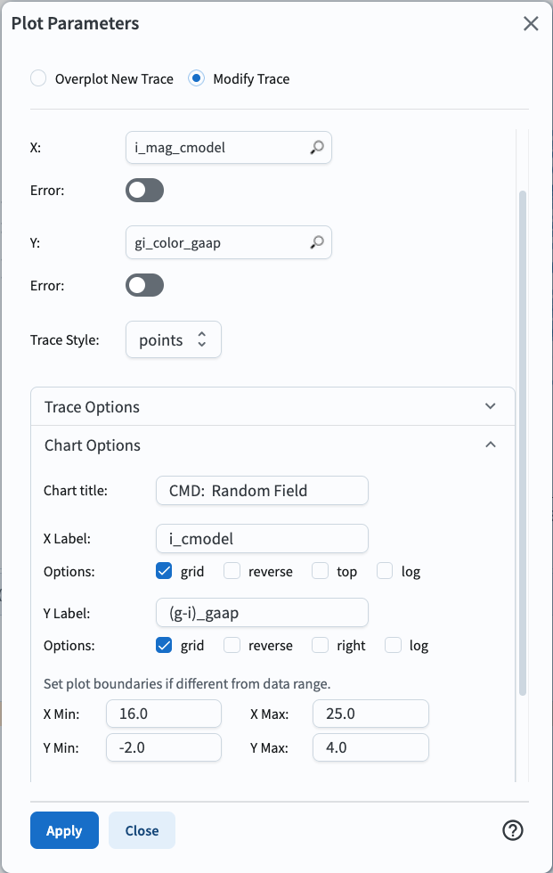
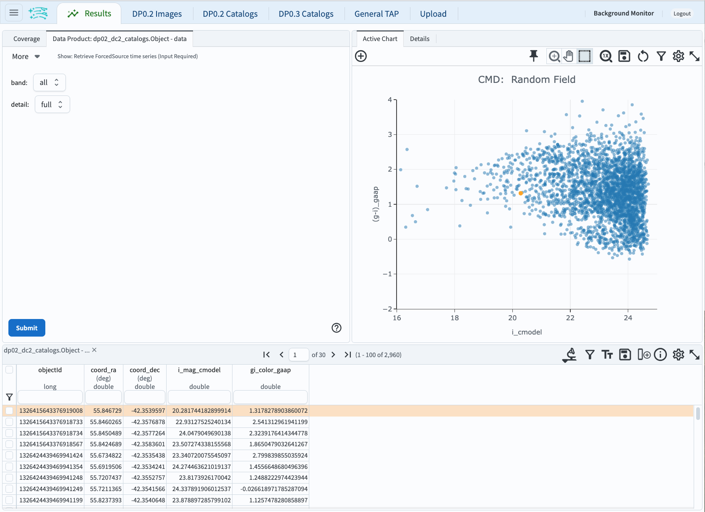
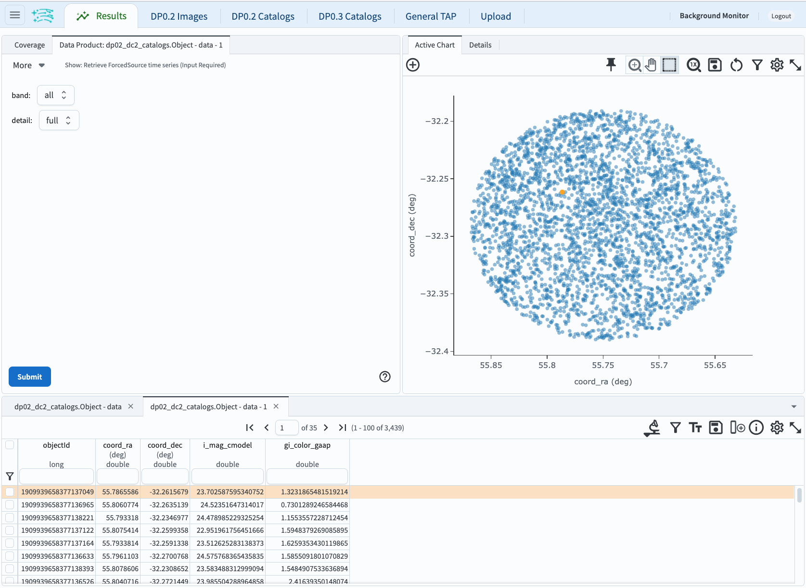
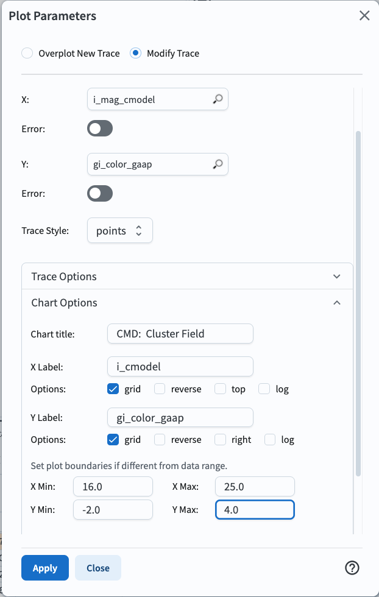

# Comparing the Color-Magnitude Diagram of a set of Field Galaxies with that of a Cluster of Galaxies (Seeing the Red Sequence)

For the Portal Aspect of the Rubin Science Platform at data.lsst.cloud.

**Data Release:** DP0

**Last verified to run:** 2025-04-01

**Learning objective:** Use the ADQL interface to compare the color-magnitude diagram of a set of field galaxies with that of a galaxy cluster. Investigate the r-band `deepCoadd` image of a galaxy cluster.

**LSST data products:** `Object` catalog, `deepCoadd` image

**Credit:** Based on tutorials developed by the Rubin Community Science team. Please consider acknowledging them if this tutorial is used for the preparation of journal articles, software releases, or other tutorials.

**Get Support:** Everyone is encouraged to ask questions or raise issues in the [Support Category](https://community.lsst.org/c/support/6) of the Rubin Community Forum. Rubin staff will respond to all questions posted there.

## Introduction

***UPDATE THIS SECTION!***

Strong lensing occurs when a 1) foreground galaxy is aligned with a background galaxy, 2) those two objects are close enough to each other, and 3) the lensing foreground galaxy is sufficiently massive.

The foreground galaxy perceptibly distorts the light from the background galaxy, and the background galaxy appears magnified and multiply-imaged, or as an arc or ring, instead of its true shape.

In this case, the background galaxy is said to be "strongly lensed".

Figure 1: A graphic demonstrating how a distant galaxy (red) appears distorted (pink) due to the mass of a foreground galaxy (blue) from Earth's perspective (right side), and appears as a strongly-lensed object in an image (left side).

**Data Preview 0.2 vs. Data Preview 1**

***UPDATE THIS SECTION!***

In the Data Preview 0.2 (DP0.2) simulation there are no strongly-lensed objects, like there will be in the real data released as Data Preview 1 (DP1).
None of the "potential foreground lens" galaxies explored in this tutorial will have any lensed objects nearby.
Furthermore, for DP1 the exact types of measurements and their column names are likely to be different, compared to DP0.
The LSST Science Pipelines have evolved considerably since being run on the DP0.2 simulation. 

**This is not an introductory-level tutorial!**
Find tutorials on the Portal's User Interface, ADQL interface, and the Results Viewer in the [DP0.2 documentation](dp0-2.lsst.io).

**Related tutorials relevant to galaxy science.**
See also the DP0.2 portal tutorials on exploring extended object populations, and the SAOImage DS9-like functionalities of Firefly.

## 1. Execute the ADQL query.

### 1.1. Log in to the RSP Portal.

In a browser, go to the URL [data.lsst.cloud](https://data.lsst.cloud).

Select the Portal Aspect and follow the process to log in.

### 1.2. Navigate to the DP0.2 ADQL interface.

From the top menu bar, select the "DP0.2 Catalogs" tab.

Notice that various tables are available in the drop-down menus.

Notice also that query constraints can be set up in this table interface.

At upper right, click the toggle to "Edit ADQL".

### 1.3. Execute the ADQL query.

Copy and paste the following into the ADQL Query box.

At lower left, click the blue "Search" button.

~~~~mysql    
SELECT obj.objectId, obj.coord_ra, obj.coord_dec, 
	   obj.g_cModelFlux, obj.r_cModelFlux, obj.i_cModelFlux, 
	   obj.g_cModelFluxErr, obj.r_cModelFluxErr, obj.i_cModelFluxErr, 
	   -2.5*log10(obj.g_cModelFlux)+31.4 as g_mag, 
	   -2.5*log10(obj.r_cModelFlux)+31.4 as r_mag, 
	   -2.5*log10(obj.i_cModelFlux)+31.4 as i_mag,
	   1.086*(obj.g_cModelFluxErr/obj.g_cModelFlux) as g_magerr, 
	   1.086*(obj.r_cModelFluxErr/obj.r_cModelFlux) as r_magerr, 
	   1.086*(obj.i_cModelFluxErr/obj.i_cModelFlux) as i_magerr
FROM dp02_dc2_catalogs.Object AS obj 
WHERE (obj.detect_isPrimary = 1) AND (obj.refExtendedness = 1) AND 
	  (obj.g_cModelFlux > 0) AND (obj.r_cModelFlux > 0) AND (obj.i_cModelFlux > 0) AND 
	  (obj.i_cModelFlux/obj.i_cModelFluxErr > 20) AND 
	  CONTAINS(POINT('ICRS', obj.coord_ra, obj.coord_dec),
             CIRCLE('ICRS',56.7506834813934,-31.28892993702273, 0.1)) = 1
~~~~

**About the query.**

The query selects 15 columns to be returned from the DP0.2 `Object` table.

* an object identifier (integer)
* the coordinates right ascension and declination
* object flux measurements in the g, r, and i filters
* object flux error measurement in the g, r, and i filters
* object magnitude measurements (corresponding the object flux measurements) in the g, r, and i filters
* object magnitude error measurements (corresponding the object flux error measurements) in the g, r, and i filters

The query constrains the results to only include rows (objects) that are:

* in the search area (within a 0.1 degree radius of RA, Dec = 56.7506834813934 deg, -31.28892993702273 deg)
* not a duplicate or parent object (`detect_isPrimary` = 1)
* an extended object, not a point-like source (`refExtendedness` = 1)
* non-zero flux in the g, r, and i bands (gaapOptimalFlux $>$ 0)
* high signal-to-noise in the i band (i_gaapOptimalFlux/i_gaapOptimalFluxErr $>$ 20)

Details about the object flux measurements:

* Photometric measurements are stored as fluxes in the tables, not magnitudes.
* `Object` table fluxes are in nJy and are converted to AB magnitue via the equation $m = -2.5\log(f) + 31.4$.
* The SDSS [Composite Model Magnitudes](https://www.sdss3.org/dr8/algorithms/magnitudes.php#cmodel)
or `cModel` fluxes are used.

## 2. Choose an extended object.

### 2.1. Confirm the results view.

The query should have returned 3154 objects.

The results view should appear similar to the figure below (panel size ratios or colors may differ).

Figure 2: The default results view after running the query. At upper left, the [HiPS](https://aladin.cds.unistra.fr/hips/) coverage map with returned objects marked individually, or in [HEALPix](https://sourceforge.net/projects/healpix/) regions (diamonds). At upper right, the active chart plots 2 columns by default. Below is the table of returned data.

### 2.2. Select an object.

Large scale clustering of the bright red extended objects can be seen in the active chart.

Click on any point in one of the clumps, and it will be highlighted in all three panels.

In the coverage map at upper left, zoom in on the selected point in the HiPS map.

Figure 3: The results view after selecting an object and zooming in on the coverage chart.

## 3. View the object in the deep coadd.

The HiPS maps are intended for quicklook and data discovery, not scientific analysis, but the corresponding `deepCoadd` images can be retrieved.

### 3.1. Select the object in the table.

Click the box in the leftmost column of the table to select the row.

### 3.2. Create an image query for the selected object.

In the table's upper right corner, there are several icons.

Hover over the first in the row, and the pop-up "Search drop down: search based on table" will appear.

Click the icon to see the search drop down menu.

Click on "Search ObsTAP for images at row".

Figure 4: The search drop down menu.

### 3.3. Search ObsTAP for images

The default query is a search for any kind of image.

Update the query to only search for deep coadd images.

At left, under "Calibration Level", click the box next to 3, and under "Data Product Subtype" select `lsst.deepCoadd_calexp`.

Click the blue "Search" button at lower left.

Figure 5: The ObsTAP interface set to search for deep coadd images of the selected object.

### 3.4. View the object in the deep coadd image

Twelve deep coadd images, two per LSST filters u, g, r, i, z, and y, are retrieved because deeply coadded images overlap at the edges, and the object was in the overlap zone.

The image that is selected in the table will display in the upper-left panel (the HiPS map is still there in the Coverage tab).

Objects from the first query will be marked on the image.

Zoom in on the object of interest.

Figure 6: The r-band deep coadd image, zoomed in on the object of interest.

## 4. Exercises for the learner.

Feel free to simply play around in the Portal.

The image viewer interface is called "Firefly".

It has a toolbar with functionality such as image scaling, recentering, line cut plots, and so on.

The cutout functionality is still in development.

Click on icons and try the tools.

The button to restore defaults is under the wrench-and-hammer icon.

