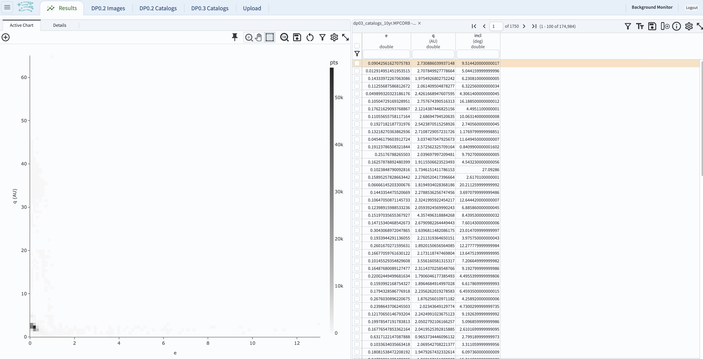
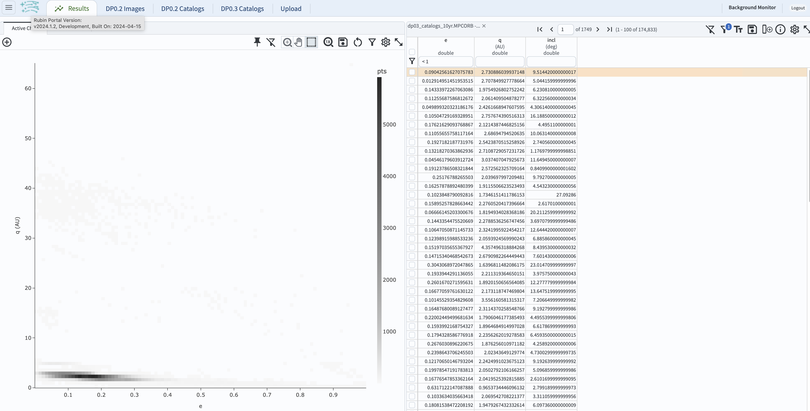
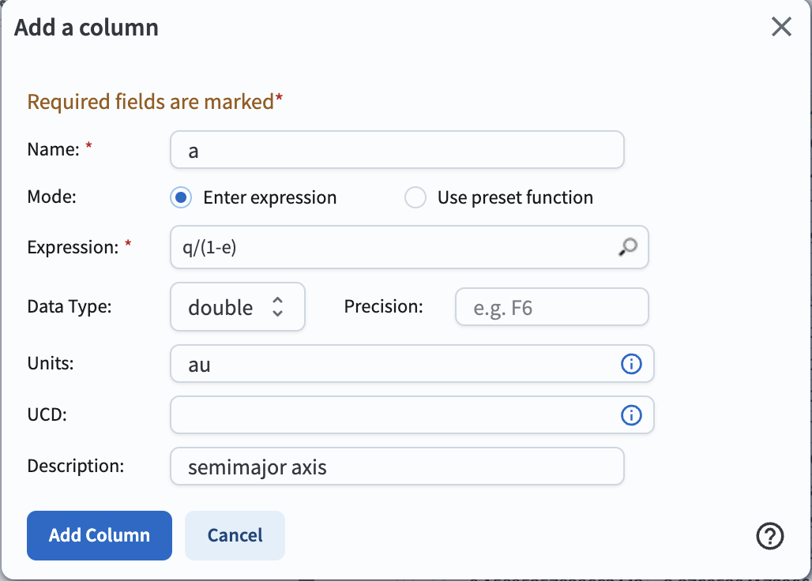
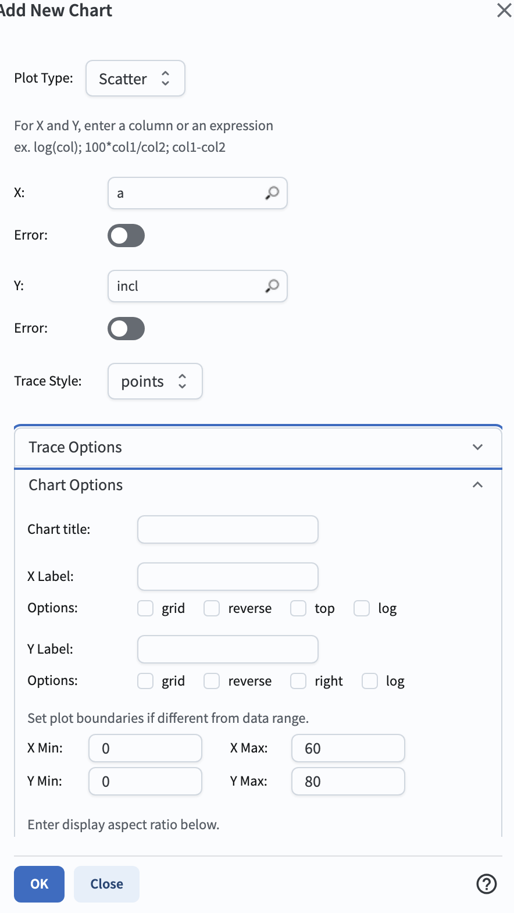
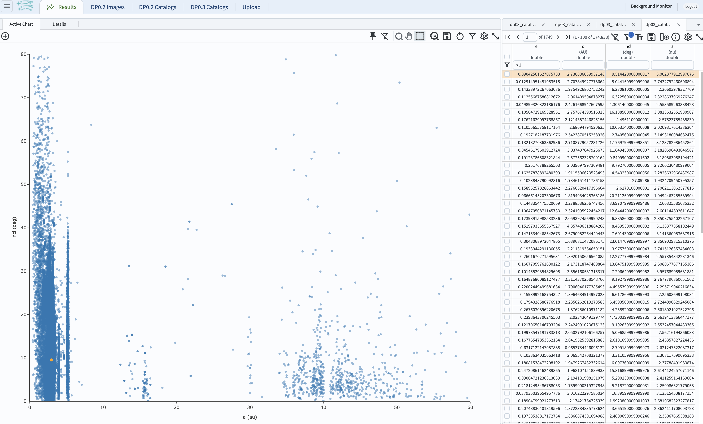
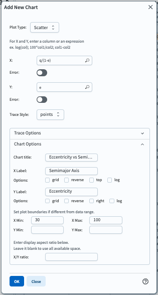
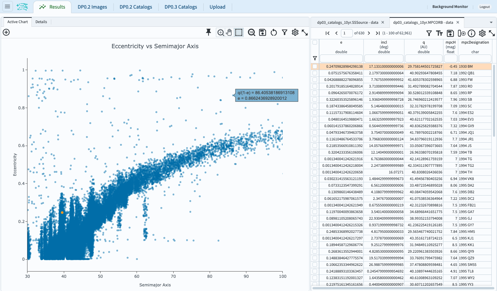
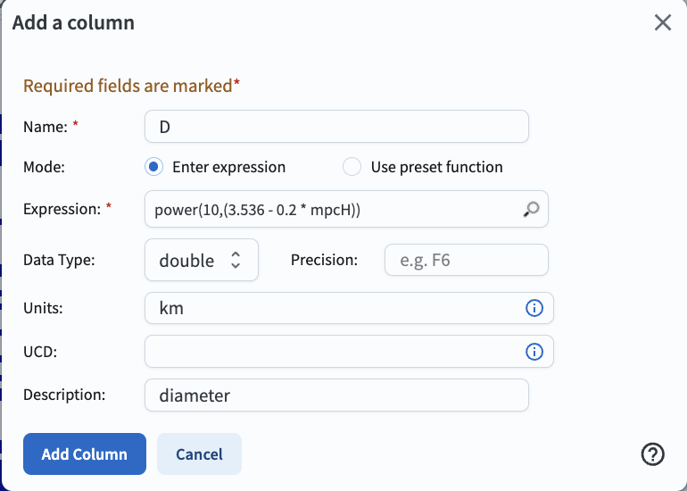
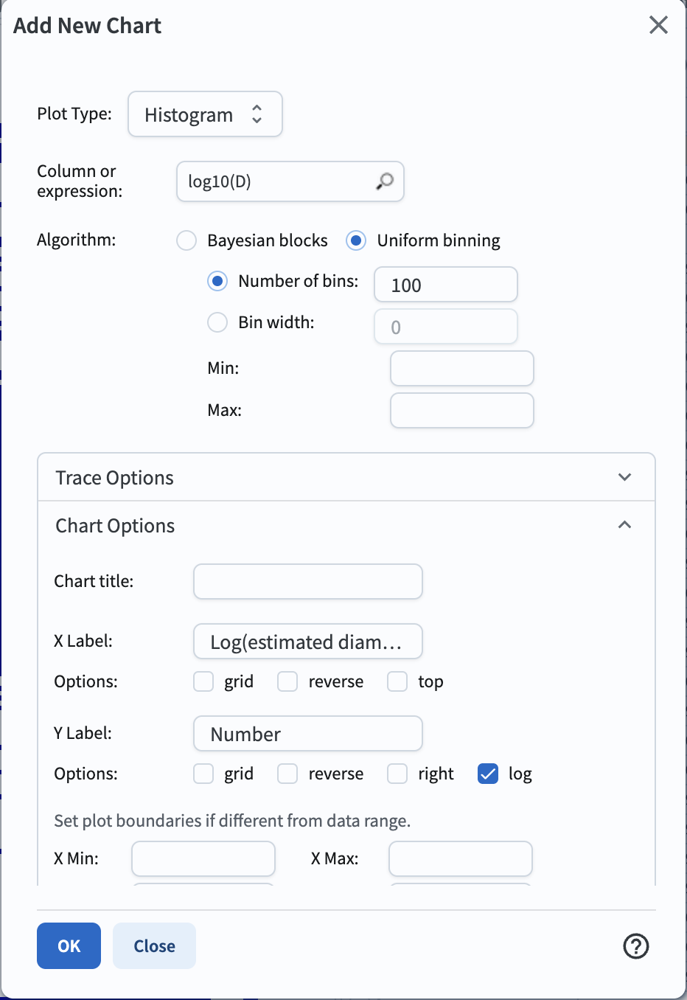
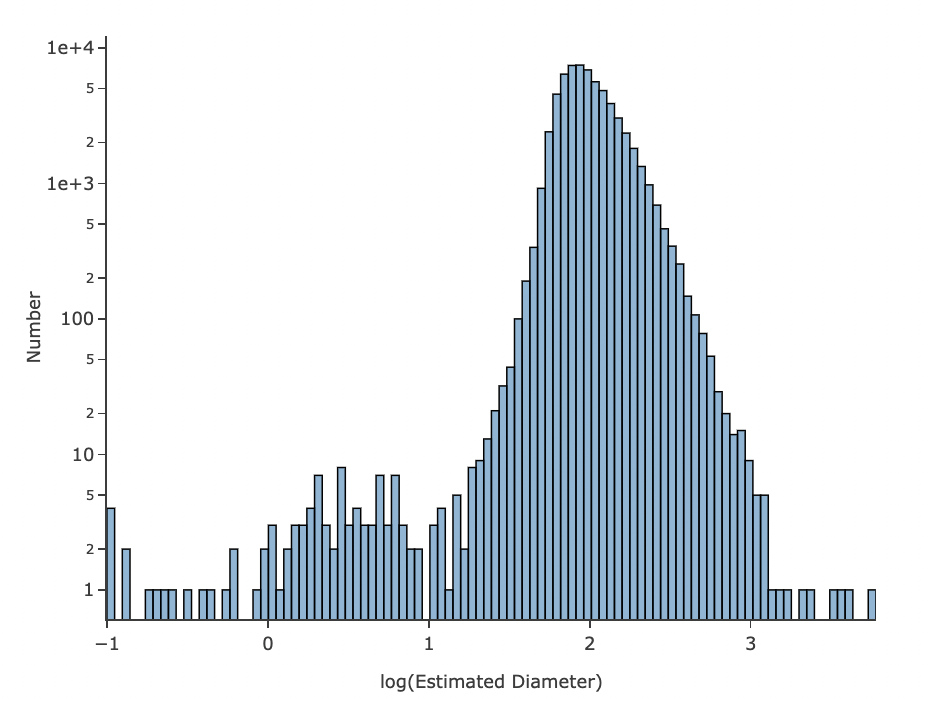

# Explore Transneptunian Objects (TNOs) in DP0.3

**RSP Aspect:** Portal

**Contact authors:** Greg Madejski and Melissa Graham

**Last verified to run:** April 22, 2025

**Targeted learning level:** Intermediate

## Introduction

This demo shows how to identify and explore a population of transneptunian objects (TNOs) in the simulated DP0.3 catalogs.
TNOs are defined by having orbits with semimajor axes beyond the orbit of Neputne (``a`` > 30.1 AU).
The DP0.3 simulated data set does not include the semimajor axis (``a``) in the ``MPCORB`` table, however it can be derived from the 
orbit's eccentricity (``e``) and perihelion distance (``q``), which are both available in the ``MPCORB`` table, via ``a`` = ``q``/(1.0 -``e``).  This allows for a sample of TNOs to be identified in the DP0.3 data set (see Step 1). TNO properties (specifically, the relationship between their semimajor axis and eccentricity, as well as the distribution of their derived diameters) will be explored in Step 2. Note that some of the objects might have ``e`` >= 1, which means they are not bound to the Solar System and are moving on parabolic or hyperbolic orbits. Such objects will be excluded from this demo, as an application of the formula above would result in a negative value of ``a``.  

Compared to the Solar System objects closer to the Earth, such as Main Belt Asteroids or Near-Earth Objects (NEOs), TNOs move relatively slowly across the sky. 

This demo uses the Astronomy Data Query Language (ADQL), which is similar to SQL (Structured Query Language). For more information about the DP0.3 catalogs, tables, and columns, see the :ref:`DP0-3-Data-Products-DPDD`.  

## Step 1. Identify a population of TNOs

### 1.1. Log into the Rubin Science Platform at [data.lsst.cloud](https://data.lsst.cloud>) and select the Portal Aspect.
Click on "DP0.3 Catalogs" tab to get to the "dp03_catalogs_10yr" table collection.  

### 1.2. At upper right, next to "View" choose "Edit ADQL".
Enter the following ADQL statement into the ADQL Query box. It will return the eccentricity (``e``), perihelion distance (``q``), and inclination (``incl``) for a random subset of objects in the ``MPCORB`` table. For an explanation of why this constraint on ``ssObjectId`` returns a random sample, see Step 2 of DP0.3 Portal tutorial 01: "Introduction to DP0.3: the ``MPCORB`` and ``SSObject`` tables.

~~~~mysql 

    SELECT e, q, incl 
    FROM dp03_catalogs_10yr.MPCORB 
    WHERE ssObjectId > 9000000000000000000 
~~~~

### 1.3. Set the "Row Limit" to be 200000 and click "Search".  

### 1.4. The default results view will show a heatmap plot of ``q`` vs. ``e`` at left, and the table view at right.

<!---
Figure 1: The default results view for the query, with the table at right and the heatmap at left.
-->

### 1.5.  Exclude the objects moving on unbound orbits.  
Note that a small fraction of the objects - roughly one in a thousand - have derived eccentricities > 1, which means they are not bound to the Solar System.  
Those objects can be excluded from further analysis by entering ``< 1`` in the box underneath the table heading ``e``, and hitting "enter."  
This will result in a slightly modified display as below.  

<!---
Figure 2: The view for the query with ``e < 1``. 
-->

### 1.6. Create a new column in the table, containing semimajor axis, ``a``.
In the upper right column of the table panel, click on the icon to add a column (a tall narrow rectangle to the left of a + sign).
In the pop-up window to "Add a column", set the "Name" to "a", the "Expression" to "q/(1.0-e)", the "Units" to "au",
and the "Description" to "semimajor axis".  
Click "Add Column", and see the new column appear in the table.

<!---
Figure 3: Screenshot showing the "Add a column" pop-up window.
-->

### 1.7. Create a scatter plot of inclination vs. semimajor axis.
In the plot panel, click on the "+" sign the upper left side.  
This will bring up the "Add New Chart" pop-up window.  
Set the "Plot Type" to "Scatter", the "X" to "a", "Y" to "incl".
In the "Chart Options" dropdown menu, set the "X Min" to "0", the "X Max" to 60, the "Y Min" to 0, and the "Y Max" to 80.  
Click "OK".

<!---
Figure 4: Screenshot showing how to create a new plot with these parameters.
-->

### 1.8. Delete the default plot by clicking on the blue cross in the upper right corner, so that only the newly-created plot appears (it should look like the plot below).
TNOs appear as a distinct population with ``a`` > 30.1 au in this parameter space.

<!---
Figure 5: The population of TNOs has x-values greater than 30 au.
-->

### 1.9.  Notice that in the plot above, the majority of objects returned by the query have semimajor axes less than 30.1 au.  
In fact, only about 800 of the moving objects from the query were TNOs.
TNOs are at much larger distances from the Sun than Main-Belt Asteroids, which make them fainter and harder to detect and characterize, 
so fewer TNOs are expected to be detected than Main-Belt Asteroids.
In the next step, a revised query will be used to only retrieve objects with semimajor axes greater than 30.1 au.

## Step 2. Explore the properties of a population of TNOs

### 2.1.  Now isolate the population of transneptunian objects and further explore their properties.  
To study the properties of a larger sample of TNOs, return to the ADQL query interface by clicking on "DP0.3 Catalogs" tab, and clicking on "Edit ADQL" button.  

### 2.2.  Clear the ADQL query, and execute the query below, which is simiar to the one in Step 1.2 but includes only objects at ``a`` > 30.1 au.
Also include the absolute H magnitude ``mpcH`` which will be used in the derivation of TNO diameters in the subsequent step (2.6) below.
As TNOs aren't the only solar system objects beyond Neptune, reject objects with `mpcDesignation` as
Long Period Comets (LPC).

~~~~mysql 

    SELECT e, incl, q, mpcH, mpcDesignation  
    FROM dp03_catalogs_10yr.MPCORB
    WHERE q / (1 - e) > 30.1 
    AND SUBSTRING(mpcDesignation, 1, 3) != 'LPC'

~~~~

### 2.3. Keep the "Row limit" to 200000, and click "Search".
This query will return 62,961 objects.
The default plot in the results view will be a heatmap of inclination vs. eccentricity.  

### 2.4.  Plot the eccentricity of the orbit ``e`` as a function of the semimajor axis ``a``.  
This time (in contrast to Step 1.6 but accomplishing the same goal), calculate ``a`` from ``e`` and ``q`` via 
setting appropriate plot parameters rather than creating another column in the right-hand table.  
Start by clicking on the "+" sign on the left-hand panel to add a new chart.  

### 2.5. In the "Add New Chart" pop-up window, select "Scatter" for the plot type.
Enter "q/(1.0-e)" for the X-axis, and "e" for the y-axis.  
Increase the number of bins to 200 for both x and y to improve the resolution of the heatmap.
Expand the "Chart Options" and set the titles and labels as below.
Restrict the x-axis to ``30 < a < 100`` au.  

<!---
Figure 6: The plot parameters for the eccentricity vs. semimajor axis plot.
-->

### 2.6.  Click on the "OK" button in the "Add New Chart" window, and view the plot (see below).
Delete the default plot of inclination vs. eccentricity as it is not needed.

<!---
Figure 7: The plot of eccentricity vs. semimajor axis of transneptunian objects (TNOs).
-->

### 2.7. Multiple sub-populations are apparent in the above plot.
The majority of the objects have low eccentricity (``e < 0.3``) and a semimajor axis of about 30 to about 50 au.
There are several sub-populations of transneptunian objects, such as the classical, resonant, scattered-disk, and detached sub-populations.
A full review of all TNO sub-populations is beyond the scope of this tutorial.

### 2.8.  Estimate the diameters of the objects using their absolute H magnitudes. 
Where ``H`` is the absolute H magnitude (column ``mpcH``), and ``A`` is the albedo, the diameter :math:`d` 
in kilometers is :math:`d = 10^{(3.1236 - 0.5 \times log(A) - 0.2 \times H)}`.
This tutorial adopts an albedo value of 0.15 (as is commonly adopted, e.g., [Vilenius et al. 2012](https://arxiv.org/pdf/1204.0697.pdf),
with which the expression reduces to :math:`d = 10^{(3.536 - (0.2 \times H))}` km.  
Click on the "add column" icon.
Enter ``D`` in the "name" field, ``power(10,(3.536 - 0.2 * mpcH))`` in the expression field, "km" as the units, and "diameter" as the description as below.
Click the "Add Column" button.  

<!---
Figure 8: How to add a new column containing the estimated diameter. 
-->

### 2.9.  Plot the distribution of estimated diameters in log-space.
Click on the "+" sign in the pop-up window, click on "Add New Chart," select "Histogram", and enter the parameters as below.  

<!---
Figure 9: The plot parameters for the distribution of estimated diameters. 
-->

### 2.10.  Click on the "OK" button.
This will result in the plot showing the distribution of estimated diameters.  

<!---
Figure 10: The distribution of estimated diameters. 
-->

### 2.11. Notice that the tail of the distribution extends to very small diameters.
This is surprising, as detecting kilometer-sized objects at the distance of Neptune 
should be quite challenging.
This illustrates, in part, some of the shortcomings of the assumptions (such as albedo)
which were used to estimate the diameters.
See also the first exercise for the learner in Step 6.
