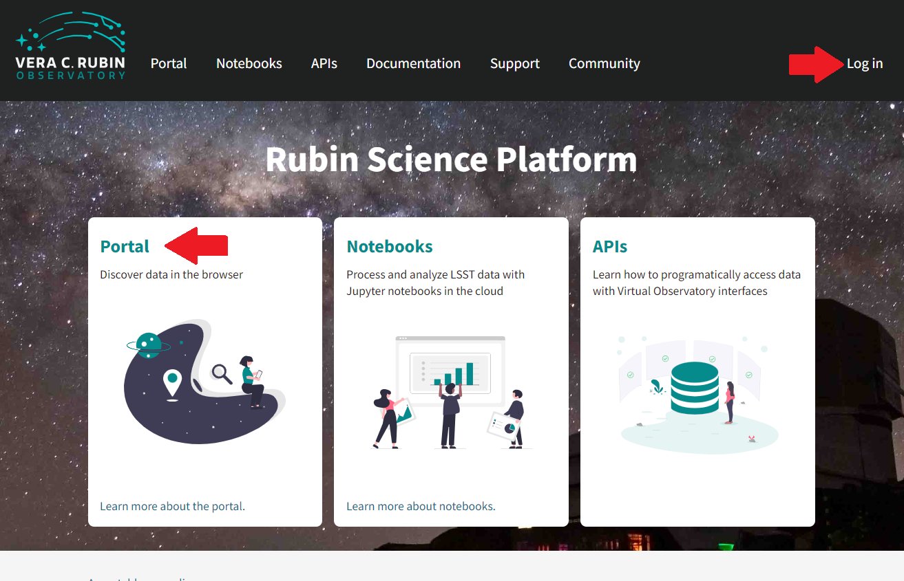
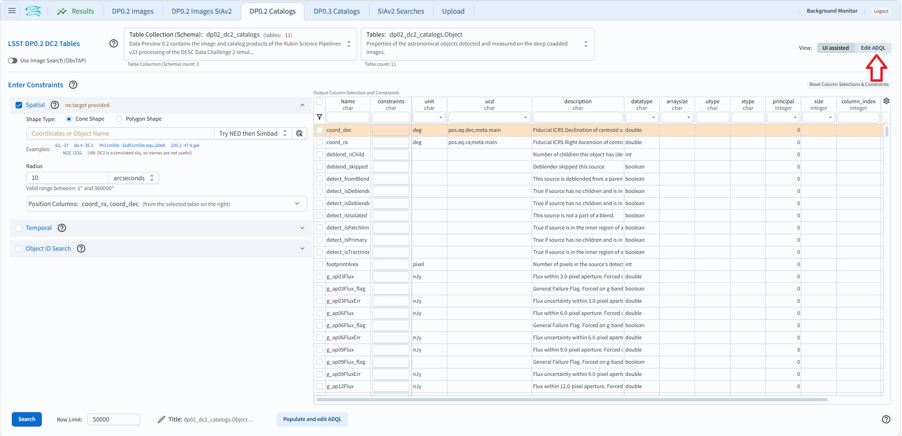
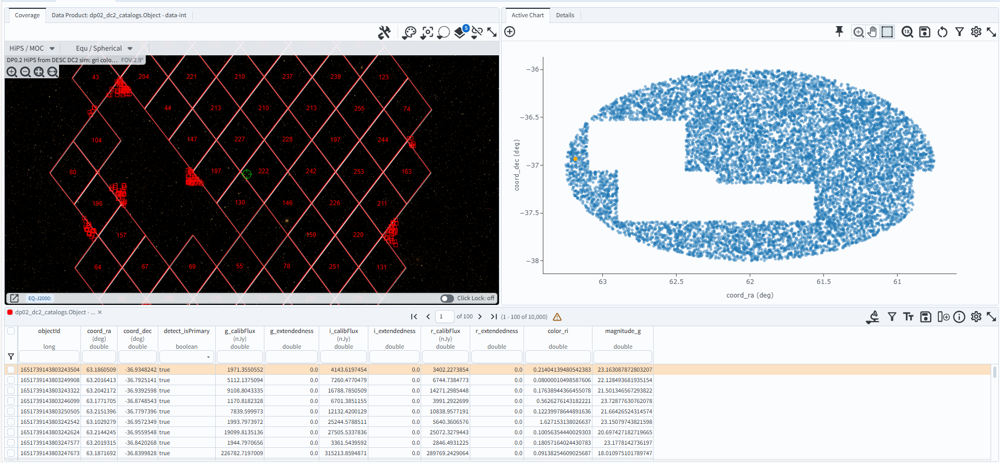
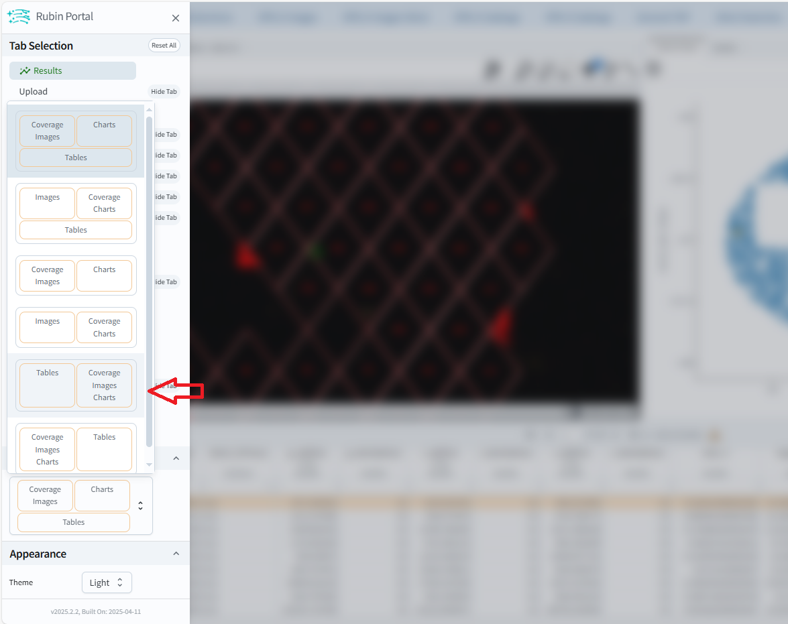
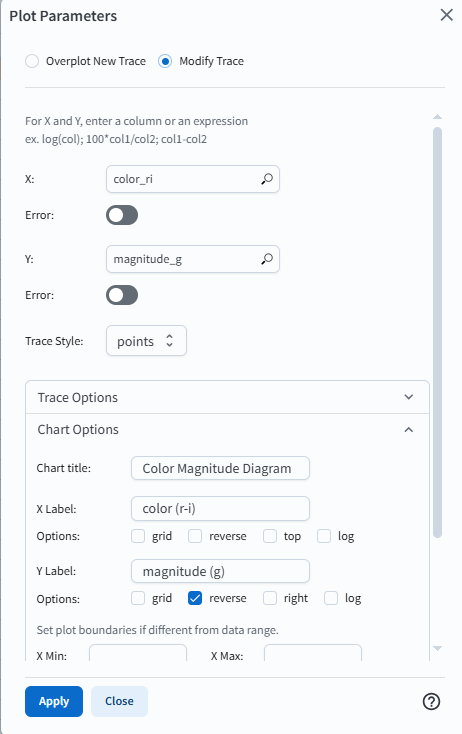
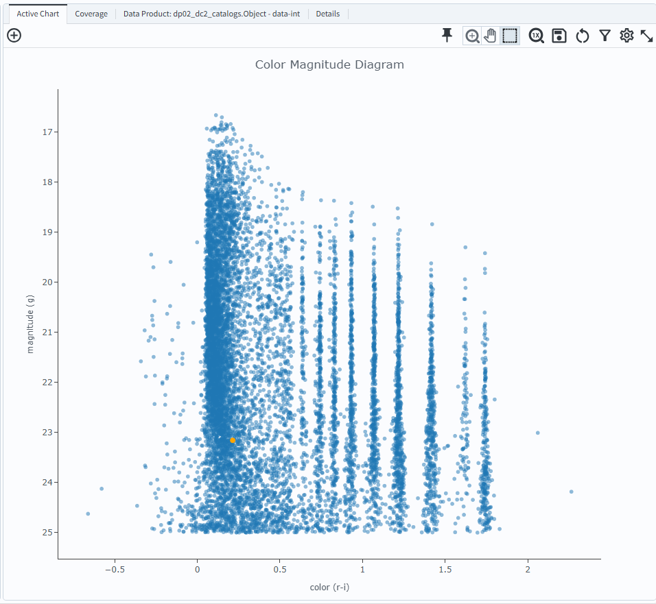

# Stars and Milky Way CMD Demo

For the Portal Aspect of the Rubin Science Platform at data.lsst.cloud.

**Data Release:** DP0

**Last verified to run:** 2025-04-11

**Learning objective:** Use the ADQL interface to query for stars and generate a Color Magnitude Diagram.

**LSST data products:** `Object` catalog

**Credit:** Based on tutorials developed by the Rubin Community Science team. Please consider acknowledging them if this tutorial is used for the preparation of journal articles, software releases, or other tutorials.

**Get Support:** Everyone is encouraged to ask questions or raise issues in the [Support Category](https://community.lsst.org/c/support/6) of the Rubin Community Forum. 
Rubin staff will respond to all questions posted there.

## Introduction

 This tutorial uses an ADQL query to search for bright stars in a small region of sky, and then uses the Results interface to create a color-magnitude diagram. 
 This tutorial is similar to the 01. Bright Stars Color-Magnitude Diagram (beginner) portal tutorial in dp0-2 documentation. Please consult that tutorial first if this tutorial is challenging. 

**Data Preview 0.2 vs. Data Preview 1**

In the Data Preview 0.2 (DP0.2) simulation stars are quantized unlike the real data to be released as Data Preview 1 (DP1).
Studying CMD to identify stellar populations within the DP0.2 dataset is still possible as the techniques used are similar.
However, for DP1 the exact types of measurements and their column names are likely to be different, compared to DP0.
The LSST Science Pipelines have evolved considerably since being run on the DP0.2 simulation. 

**Related tutorials relevant to stellar science.**
See also the DP0.2 portal tutorials on plotting histograms, light curves, extracting pixel values, and the SAOImage DS9-like functionalities of Firefly.

## 1. Execute the ADQL query.

### 1.1. Log in to the RSP Portal.

In a browser, go to the URL [data.lsst.cloud](https://data.lsst.cloud).

Select the Portal Aspect and follow the process to log in.

Figure 1: Log into the Portal aspect at the RSP

### 1.2. Navigate to the DP0.2 ADQL interface.

From the top menu bar, select the "DP0.2 Catalogs" tab.

Notice that various tables are available in the drop-down menus.

Notice also that query constraints can be set up in this table interface.

At upper right, click the toggle to "Edit ADQL".

Figure 2: Click 'Edit ADQL' button.

### 1.3. Execute the ADQL query.

Copy and paste the following into the ADQL Query box.

At lower left, change the row limit to 10,000, click the blue "Search" button.

~~~~mysql
SELECT objectId, coord_ra, coord_dec, detect_isPrimary, g_calibFlux, g_extendedness, i_calibFlux, i_extendedness, r_calibFlux, r_extendedness,
       (-2.5 * LOG10(r_calibFlux) - (-2.5 * LOG10(i_calibFlux))) AS color_ri,
       (-2.5 * LOG10(g_calibFlux) + 31.4) AS magnitude_g
FROM dp02_dc2_catalogs.Object
WHERE CONTAINS(POINT('ICRS', coord_ra, coord_dec), CIRCLE('ICRS', 62, -37, 1)) = 1
      AND detect_isPrimary = 1
      AND g_calibFlux > 360
      AND g_extendedness = 0
      AND i_calibFlux > 360
      AND i_extendedness = 0
      AND r_calibFlux > 360
      AND r_extendedness = 0
~~~~

**About the query.**

The query selects 10 columns to be returned from the DP0.2 `Object` table and creates two extra columns for (r-i) color and magnitude (g). 

* an object identifier (integer)
* the coordinates right ascension and declination
* object flux measurements in the g, r, and i filters
* two columns created are color r-i and magnitude g

The query constrains the results to only include rows (objects) that are:

* in the search area (within a 1 degree radius of RA, Dec = 62, -37 deg)
* not a duplicate or parent object (`detect_isPrimary` = 1)
* not an extended object, a point-like source (`refExtendedness` = 0)
* bright objects in g, r, and i bands (>360 nJy)

Details about the object flux measurements:

* Photometric measurements are stored as fluxes in the tables, not magnitudes.
* `Object` table fluxes are in nJy, and the conversion is: $m = -2.5\log(f) + 31.4$.

## 2. Create a color-magnitude diagram.

### 2.1. Confirm the results view.

The query should have returned 10,000 objects.

The results view should appear similar to the figure below (panel size ratios or colors may differ).

Figure 2: The default results view after running the query. At upper left, the [HiPS](https://aladin.cds.unistra.fr/hips/) coverage map with returned objects marked individually (after clicking the
coverage tab), or in [HEALPix](https://sourceforge.net/projects/healpix/) regions (diamonds). At upper right, the active chart plots 2 columns by default. Below is the table of returned data.

### 2.2. Change portal view.

Click on the hamburger icon and scroll to Results Layout. Select Tables and Coverage Image Charts. 

Figure 3: Location of Results Layout selection.

## 3. Plot color vs. magnitude.

The ADQL query returned colors for g, r, and i filters for each of the 10,000 stars discovered in step 1 and two additional
columns were included for the color (r-i) and magnitude (g). Adding those commands simplifies the steps required to plot the CMD.

In the right panel, click the 'Active Chart' tab to alter the plot. Click the gear icon in the upper right portion of the panel.  
Alter the plot parameters so that they match the values in Figure 4. (Written instructions in step 3.1 below). 

Figure 4: Parameters to alter the plot.

### 3.1. Click on the gear icon.

Click on the gear icon in the right hand plot. 
For the x-axis, select color_ri. For the y-axis, select magnitude_g. Change the chart title to "Color-magnitude diagram". Change the X Label to "color (r-i)" and
the Y Label to "magnitude (g), then click the reverse box under the Y Label. Finally, add the X Min, X Max values to "-0.5, 2.0" and the Y Min, Y Max values to "16.5 and 25.5". 
Click Apply, then Close.

Figure 5: Quantized CMD plot from dp0-2 simulation data.

