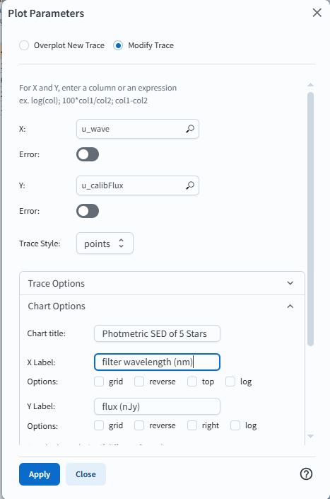

# Stars and Milky Way SED Demo

For the Portal Aspect of the Rubin Science Platform at data.lsst.cloud.

**Data Release:** DP0

**Last verified to run:** 2025-04-11

**Learning objective:** Use the ADQL interface to query for stars, generate an SED plot for 5 stars.

**LSST data products:** `Object` catalog

**Credit:** Based on tutorials developed by the Rubin Community Science team. Please consider acknowledging them if this tutorial is used for the preparation of journal articles, software releases, or other tutorials.

**Get Support:** Everyone is encouraged to ask questions or raise issues in the [Support Category](https://community.lsst.org/c/support/6) of the Rubin Community Forum. 
Rubin staff will respond to all questions posted there.

## Introduction

This tutorial uses an ADQL query to search for bright stars in a small region of sky, and then uses the Results interface to create a photometric SED. 
 

**Data Preview 0.2 vs. Data Preview 1**

In the Data Preview 0.2 (DP0.2) simulation stars are quantized unlike the real data released as Data Preview 1 (DP1).
Studying photometric SED within the DP0.2 dataset is still useful as the techniques used with the simulated data are comparable real data techniques.
However, for DP1 the exact types of measurements and their column names are likely to be different, compared to DP0.
The LSST Science Pipelines have evolved considerably since being run on the DP0.2 simulation. 

**Related tutorials relevant to stellar science.**
See also the DP0.2 portal tutorials on plotting histograms, light curves, extracting pixel values, and the SAOImage DS9-like functionalities of Firefly.

## 1. Execute the ADQL query.

### 1.1. Log in to the RSP Portal.

In a browser, go to the URL [data.lsst.cloud](https://data.lsst.cloud).

Select the Portal Aspect and follow the process to log in.

### 1.2. Navigate to the DP0.2 ADQL interface.

From the top menu bar, select the "DP0.2 Catalogs" tab.

Notice that various tables are available in the drop-down menus.

Notice also that query constraints can be set up in this table interface.

At upper right, click the toggle to "Edit ADQL".

### 1.3. Execute the ADQL query.

Copy and paste the following into the ADQL Query box.

In the row limit box, type '5', then click the blue "Search" button.

~~~~mysql 
SELECT objectId, coord_ra, coord_dec, detect_isPrimary,
       u_calibFlux, 376 AS u_wave,
       g_calibFlux, 427 AS g_wave,
       r_calibFlux, 628 AS r_wave,
       i_calibFlux, 709 AS i_wave,
       z_calibFlux, 833 AS z_wave,
       y_calibFlux, 978 AS y_wave
FROM dp02_dc2_catalogs.Object
WHERE CONTAINS(POINT('ICRS', coord_ra, coord_dec), CIRCLE('ICRS', 62, -37, 1)) = 1
      AND detect_isPrimary = 1
      AND u_calibFlux > 360
      AND u_extendedness = 0
      AND g_calibFlux > 360
      AND g_extendedness = 0
      AND r_calibFlux > 360
      AND r_extendedness = 0
      AND i_calibFlux > 360
      AND i_extendedness = 0
      AND z_calibFlux > 360
      AND z_extendedness = 0
      AND y_calibFlux > 360
      AND y_extendedness = 0
~~~~
**About the query.**

The query creates 18 columns to be returned from the DP0.2 `Object` table.

* an object identifier (integer)
* the coordinates right ascension and declination
* object flux measurements in the u, g, r, i, z, and y filters
* adds columns for filter wavelengths, this will simplify plotting the SED

The query constrains the results to only include rows (objects) that are:

* in the search area (within a 1 degree radius of RA, Dec = 62, -37 deg)
* not a duplicate or parent object (`detect_isPrimary` = 1)
* an not extended object, a point-like source (`refExtendedness` = 0)
* bright in all bands (band_calibFlux > 360)

Details about the object flux measurements:

* Photometric measurements are stored as fluxes in the tables, not magnitudes.
* `Object` table fluxes are in nJy, and the conversion is: $m = -2.5\log(f) + 31.4$.

### 1.4. Results from the ADQL query.

Figure 3: Results from SED query.

## 2. Plot the SED.

Steps required to plot an SED using the portal 'UI assisted' mode is more challenging than the ADQL query above. The query
provides the structure needed to generate an SED, but there are a number of additional steps required.  Specifically, when generating a simple plot with this data,
the results will be of all five stars in u-band rather than an SED of a single star. The steps below will show how to overcome this issue
and plot SED for five stars.

### 2.1. Click on the gear icon.

Click the gear icon in the right hand panel to alter the plot. Change the parameters as shown in Figure 3, change X to 'u_wave', Y to 'u_calibFlux'. Add a title 'SED for 5 stars'.
Label the x-axis 'filter wavelength' and y-axis 'Flux (nJy)'. Click 'Apply' then 'Close'.

Figure 4: Modify plot - parameters for u-band.

### 2.2. Results from altering the plot - u-band filter magnitudes for 5 stars.

As mentioned earlier, plotting the data from this ADQL query requires a few extra steps. Notice in Figure 5, that only the u-band values are plotted
and the dots are the same color.  

Figure 5: Results of u-band.

### 2.3. Distinguish between stars with rainbow color scale
In order to distinguish one star from another, 'Trace Options' will need to be altered in the 'Plot Parameters' window. Click on the gear icon, notice the top selection is 'Modify Trace'. 
Figure 5 shows the required changes.  First, click on 'Trace Options' to open the input space. Click in 'Color Map' and select 'g_calibFlux'. 
Using 'g_calibFlux' for each of the subsequent filter bands will provide the proper colors of the stars. Next, click the 'Color Scale' down arrow and select
'Rainbow'. 

Figure 6: Rainbow colors for each star in u-band.

Notice, the lower point in the right hand panel is larger than the other dots.  This point corresponds to the highlight star in the left hand panel.

### 2.4. Add g-band values for 5 stars

Next click the gear icon to open the plot parameter window.  Make sure you click 'Overplot new trace' to add the g-band values, not modify the u-band values.
For X, select 'g_wave' and Y, 'g_calibFlux'. There is no need to alter the title or axis labels. Click 'Trace Options' to select 'g_calibFlux' in 'Color Map' and
'Rainbow' for 'Color Scale'. Click 'Apply' and 'Close'. Note: when developing this tutorial, this step would sometimes need to be repeated.  If you complete
the step and the rainbow colors are not applied, just close the plot parameters dialog box and try again, making sure the 'modify trace' option is now selected.

Figure 6: u- and g-band values for 5 stars plotted against u- and g- filter wavelengths.

## 4. Exercises for the learner.

Feel free to simply play around in the Portal.

The image viewer interface is called "Firefly".

It has a toolbar with functionality such as image scaling, recentering, line cut plots, and so on.

The cutout functionality is still in development.

Click on icons and try the tools.

The button to restore defaults is under the wrench-and-hammer icon.

