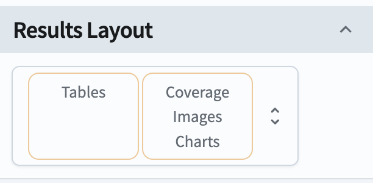

# Searching for transients and variable stars

For the Portal Aspect of the Rubin Science Platform at data.lsst.cloud.

**Data Release:** DP0

**Last verified to run:** 2025-04-07

**Learning objective:** Use the ADQL interface to query for objects whose flux varied significantly. Investigate the `DiaObject` catalog quantities, and use them to select candidate transients and variables. Plot time series lightcurves of their measurements in difference images.

**LSST data products:** `DiaObject`, `DiaSource`, and `ForcedSourceOnDiaObject` catalogs

**Credit:** Based on tutorials developed by the Rubin Community Science team. Please consider acknowledging them if this tutorial is used for the preparation of journal articles, software releases, or other tutorials.

**Get Support:** Everyone is encouraged to ask questions or raise issues in the [Support Category](https://community.lsst.org/c/support/6) of the Rubin Community Forum. Rubin staff will respond to all questions posted there.

## Introduction

The LSST is primarily a time-domain survey, and will thus uncover a wide variety of astrophysical objects whose flux varies with time, including supernovae, variable stars, active galactic nuclei, and asteroids, among many others.
The primary means of finding transients and variables is to use "difference imaging," in which newly-acquired images of the sky are compared against existing "template" images of that same region of sky to look for things that have changed.
Templates are typically built up over time as high-quality, coadded images. When a new image is acquired, difference imaging is performed by subtracting an appropriately-scaled template image from the newly-acquired science image, resulting in a "difference image" that contains only sources that changed between the template and science image. Such changes could be new objects (e.g., a supernova that recently exploded) or changes in the flux of existing objects (such as variable stars or active galactic nuclei). The following figure illustrates how difference imaging is performed:

Figure 1: Illustration of a supernova discovered in the [ZTF survey](https://antares.noirlab.edu/loci/ANT20257p4qy29ofx48). The middle panel shows the template image of a barred spiral galaxy, which was subtracted from the left-hand image of that same galaxy to produce the difference image seen on the right. The point source (a likely supernova in the spiral galaxy) that appeared in the science image, and was not present in the template, shows clearly as the only obvious source in the difference image.

In the LSST Science Pipelines, detections of sources on difference images are known as `DiaSources`, and their measurements are contained in the `DiaSource` table. Each `DiaSource` corresponds to a `DiaObject`, where a `DiaObject` can be thought of as corresponding to a single astrophysical object (i.e., a star, asteroid, supernova, etc.). Thus the `DiaObject` table contains a list of "objects" identified from difference images, plus statistics summarizing all of the `DiaSource` measurements of each object. Light curves can be built from the `DiaSource` tables, or additionally from the "forced" measurements performed on difference images at the positions of all `DiaObjects`. These appear in the `ForcedSourceOnDiaObject` tables.

In this tutorial, we will explore using statistics reported in the `DiaObject` table to select candidate transients and variables, then extracting time series from either `DiaSource` or `ForcedSourceOnDiaObject` tables to examine light curves.

## 1. Execute the ADQL query.

### 1.1. Log in to the RSP Portal.

In a browser, go to the URL [data.lsst.cloud](https://data.lsst.cloud).

Select the Portal Aspect and follow the process to log in.

### 1.2. Navigate to the DP0.2 ADQL interface.

From the top menu bar, select the "DP0.2 Catalogs" tab.

Notice that various tables are available in the drop-down menus.

Notice also that query constraints can be set up in this table interface.

At upper right, click the toggle to "Edit ADQL".

### 1.3. Execute the ADQL query.

Copy and paste the following into the ADQL Query box.

At the lower left, click the blue "Search" button.

~~~~mysql    
SELECT ra, decl, diaObjectId, nDiaSources, gPSFluxNdata,
    gPSFluxSigma, gPSFluxMean,
    gPSFluxStetsonJ, gPSFluxChi2, gPSFluxMAD,
    gPSFluxPercentile25, gPSFluxPercentile75, gTOTFluxMean,
    rPSFluxStetsonJ, rPSFluxChi2, rPSFluxMAD, 
    rPSFluxMean, rPSFluxSigma, rPSFluxLinearSlope,
    scisql_nanojanskyToAbMag(gTOTFluxMean) as gmag,
    scisql_nanojanskyToAbMag(rTOTFluxMean) as rmag
    FROM dp02_dc2_catalogs.DiaObject
    WHERE nDiaSources > 10
        AND rTOTFluxMean < 1e5
        AND rPSFluxMax < 1e5
        AND rPSFluxMin > -1e5
        AND rPSFluxNdata > 8
        AND CONTAINS(POINT('ICRS', ra, decl), CIRCLE('ICRS', 56.1, -33.2, 5)) = 1
~~~~

**About the query.**

The query selects many columns to be returned from the DP0.2 `DiaObject` table.

* a diaObject identifier (integer)
* the coordinates right ascension and declination
* the total number of DiaSources and number of detections in each band
* mean object flux measurements from science images in g and r filters (e.g., `gTOTFluxMean`)
* mean object flux measurements from difference images in g and r filters (e.g., `gPSFluxMean`)
* statistics characterizing the ensemble of measurements from all difference images

The query constrains the results to only include rows (objects) that are:

* in the search area (within a 5 degree radius of RA, Dec = 56.1, -33.2 deg)
* not likely to be saturated in either the science image or difference image (abs(flux) < 1e5)
* has at least 10 DiaSources (`nDiaSources` > 10; over all bands) and 8 detections in r-band difference images (`rPSFluxNdata` > 8)

Details about the object flux measurements:

* Photometric measurements are stored as fluxes in the tables, not magnitudes.
* `DiaObject` table fluxes are in nJy, and the conversion is: $m = -2.5\log(f) + 31.4$.
* Point-source fluxes extracted using the best-fit point-spread function (PSF) are used for all explorations in this tutorial. In DP0.2 DIA products, these have "PSFlux" in the column names.

## 2. Choose an object likely to be a supernova.

### 2.1. Confirm the results view.

The query should have returned 36322 objects.

The results view should appear similar to the figure below (panel size ratios or colors may differ).

Figure 2: The default results view after running the query. At upper left, the [HiPS](https://aladin.cds.unistra.fr/hips/) coverage map with returned objects marked individually, or in [HEALPix](https://sourceforge.net/projects/healpix/) regions (diamonds). At upper right, the active chart plots 2 columns by default. Below is the table of returned data.

### 2.2. XXXXXXXX

Hide the coverage map by clicking the "hamburger" menu (3 horizontal lines) at the upper left, then selecting the following "results layout" from the menu:

Figure 3: ZZZZZZZZ

Highlight the "active chart" tab in the right half of the screen. Click the "+" sign at the upper left of the tab to bring up the "Add New Chart" dialog.

Use the default plot type of "scatter", and select `rPSFluxMean` for the X axis, and `rPSFluxLinearSlope` for the Y axis. Then click "OK" to create the plot. (You can close the original RA, Dec heatmap figure at this point by clicking the "x" at its top right corner.)

Create another new scatter plot, this time with "rPSFluxSigma" vs "rPSFluxMean". You should now have two scatter plots side-by-side.

Select the plume of objects with large negative `rPSFluxLinearSlope` values and slightly positive `rPSFluxMean`.

Use the "box select" tool:

Select a box, then click the double check-mark at the top to select the points. Then you should see something like this:

Select one of the highlighted objects, then change to the "Data Products: dp02_dc2_catalogs.DiaObject - data" tab.

Under the "More" dropdown menu, select "Show: Retrieve DiaSource time series", then click the blue "Submit" button at lower left. By default, a table will appear. Change to the "Chart" by clicking the toggle at the top of the tab.

By default, this should show the first two columns of the table, which for a time series will be "apFlux (nJy)" vs. "expMidptMJD (d)". It should look something like the following figure (though the data will differ depending which point you selected):

### 2.2. Select candidate variable stars

Change the two scatter plots to instead show `gPSFluxStetsonJ` vs. `gmag`, and `gPSFluxChi2` vs. `gmag`.

Next, in the table view, select only points with more than 30 g-band measurement by adding the constraint ">30" in the `gPSFluxNdata` column.

This should reduce the number of selected objects to 499, and your plots should look like the following:

Select a relatively bright outlier (e.g., with `gmag` < 21) that lies above the blob of points clustered at `gPSFluxStetsonJ` = 0 and `gPSFluxChi2` = 0.

As before, switch to the "Data product: " tab. Under the "More" dropdown, select "Show: Retrieve ForcedSourceOnDiaObject time series" (note that we want the ForcedSourceOnDiaObject here, because near its mean flux, a variable object will not produce a DiaSource).

For clarity, select a single band (e.g., "g" or "r") before plotting the time series. Then click "Submit" at the bottom, and you should obtain a plot that looks similar to the following:

This object's flux is clearly fluctuating by a fair amount. It seems like a good candidate to be a variable star! Now you may want to extract all the time series data for this particular object and do more detailed periodicity analysis offline, _or_ note its DiaObjectID and use that to extract its light curve in the Notebook aspect of the RSP.

